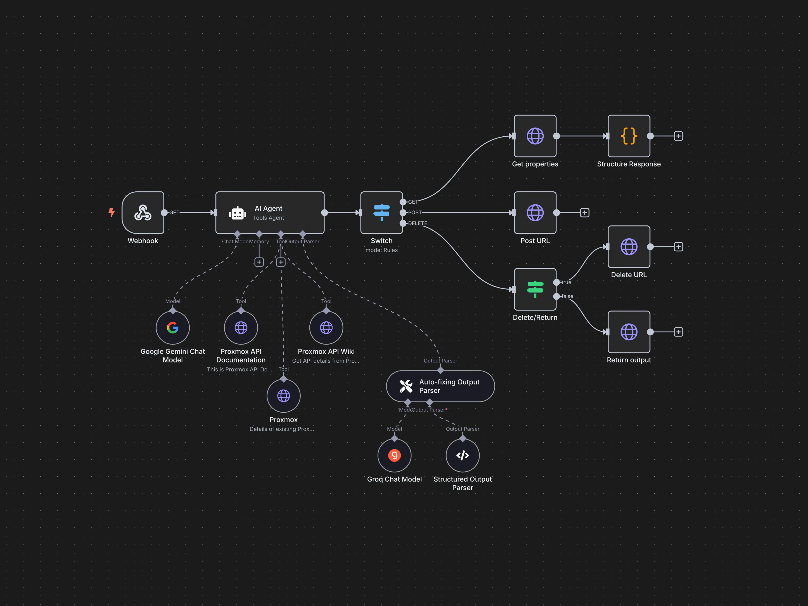

# 🔁 Проксирование n8n через AEZA, Tailscale и NGINX

> Автоматизируй локально, публикуй безопасно — и всё это без дорогих VPS.

---

## 📦 Что такое n8n?

[`n8n`](https://n8n.io/) — это мощная open-source платформа для автоматизации, сопоставимая с Zapier, Make или IFTTT, но с полным контролем на своей стороне.

### 💡 Возможности:

* 350+ готовых интеграций (Telegram, Gmail, Notion, Discord и др.)
* Поддержка Webhook-ов, REST API, событий и расписаний
* Встроенное выполнение JavaScript прямо в автоматизациях
* Самостоятельный хостинг (Docker, VPS, или даже локальный ПК)
<!--truncate-->


---

## 🧰 Что использовалось

* 💻 **Локальный ПК** — с установленным Docker и `n8n`
* 🌍 **[Aéza](https://aeza.net/?ref=507375)** — хостинг (регион: Frankfurt, тариф: `Shared1`)
* 🌐 **Домен** — куплен на [Aéza](https://aeza.net/?ref=507375)
* 🚼 **[Tailscale](https://tailscale.com)** — mesh-VPN для связи хостинга и ПК
* 🔒 **NGINX** + Let's Encrypt — для HTTPS-прокси

---

## 🔒 Tailscale: приватная сеть

[Tailscale](https://tailscale.com) работает на базе WireGuard и позволяет строить mesh-сеть между устройствами. Выходы в интернет через VPN не требуются — весь трафик остаётся внутри приватного туннеля.

### ⚙️ Преимущества:

* Простой запуск без проброса портов
* P2P-соединение с минимальной задержкой
* Поддержка ACL, SSH, DNS, MagicDNS, subnet routers и пр.
* Есть версии под все популярные ОС

> ❌ **Важно:** В РФ доступ к Tailscale ограничен — сайт и панель могут блокироваться.

---

## 🐳 Быстрый запуск n8n в Docker

```bash
docker run -d --name n8n --restart=always \
  -p 5678:5678 \
  -v n8n_data:/home/node/.n8n \
  -e N8N_HOST=your.domain.tld \
  -e N8N_PORT=5678 \
  -e N8N_PROTOCOL=https \
  -e WEBHOOK_URL=https://your.domain.tld/ \
  docker.n8n.io/n8nio/n8n
```

### Советы:

* Убедись, что `WEBHOOK_URL` соответствует внешнему адресу
* Используй volume для постоянного хранения данных

---

## 🌐 Прокси через NGINX на AEZA

На сервере с публичным IP настраивается NGINX, чтобы принимать внешние запросы и проксировать их к `n8n` по Tailscale.

### Пример конфига:

```nginx
server {
    server_name your.domain.tld;
    listen 443 ssl http2;

    ssl_certificate /etc/letsencrypt/live/your.domain.tld/fullchain.pem;
    ssl_certificate_key /etc/letsencrypt/live/your.domain.tld/privkey.pem;

    location / {
        proxy_pass http://100.x.x.x:5678;

        proxy_http_version 1.1;
        proxy_set_header Upgrade $http_upgrade;
        proxy_set_header Connection "upgrade";
        proxy_set_header Host $host;
        proxy_set_header X-Real-IP $remote_addr;
        proxy_set_header X-Forwarded-For $proxy_add_x_forwarded_for;
        proxy_set_header X-Forwarded-Proto $scheme;
    }
}
```

> 📌 IP вида `100.x.x.x` — это адрес из Tailscale-сети, выдается каждому подключенному устройству.

---

## 🔐 Как отключить ECH в Cloudflare

Если сайт работает через Cloudflare, он может быть **недоступен в РФ** из-за **ECH (Encrypted Client Hello)**. В бесплатном тарифе отключить ECH можно только через API.

### ⚖️ Команда:

```bash
curl -X PATCH "https://api.cloudflare.com/client/v4/zones/ID_ZONE/settings/ech" \
  -H "X-Auth-Key: YOUR_GLOBAL_API_KEY" \
  -H "X-Auth-Email: YOUR_EMAIL" \
  -H "Content-Type: application/json" \
  --data '{"id":"ech","value":"off"}'
```

### 🧰 Где взять данные:

* `ID_ZONE` — находится на вкладке Overview в панели Cloudflare
* `YOUR_GLOBAL_API_KEY` — в профиле: API Tokens → Global API Key → View
* `YOUR_EMAIL` — email вашего аккаунта

### ✅ Проверка:

Открой:

```
https://dns.google/resolve?name=ВАШ_САЙТ&type=HTTPS
```

Если в ответе нет `ECH`, значит отключение сработало.

---

## 📟 Альтернатива Tailscale

Если Tailscale вам недоступен, рассмотрите альтернативы:

* [ZeroTier](https://www.zerotier.com/)
* [Nebula](https://github.com/slackhq/nebula)
* WireGuard с ручной настройкой

---

## ✅ Вывод

Сочетание **[Aéza](https://aeza.net/?ref=507375)**, **[Tailscale](https://tailscale.com)** и **[n8n](https://n8n.io/)** позволяет запускать полноценные автоматизации у себя дома с публичным доступом по HTTPS — при этом без аренды дорогого VPS и полного контроля за всей системой.

> Такой подход удобен как для продвинутых энтузиастов, так и для тех, кто хочет максимум безопасности и приватности.
